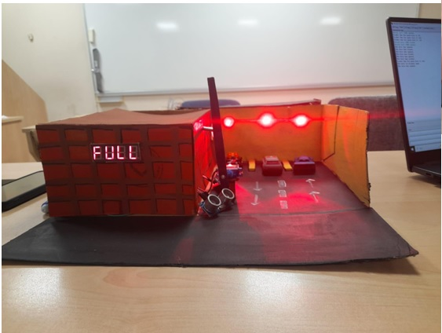
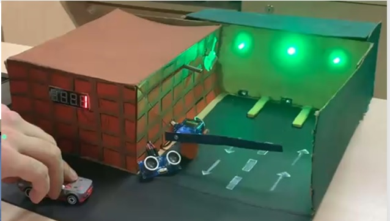

# Automated-Parking-Lot-
CmpE 443 Principles of Embedded Systems Design Student Project : Automated Parking Lot Project 

Project Context: Developed for an Embedded Systems Programming course. Microcontroller: STM32L552ZE (using STM32CubeIDE). Implementation: A pure bare-metal solution was employed, focusing on direct register access and excluding all standard or external libraries (such as HAL/LL). This approach provided in-depth control and understanding of the MCU's architecture.

# Project Video 

Youtube Link : [# Automated-Parking-Lot](https://youtu.be/Bs-tmBPICh4)

# Project Images

